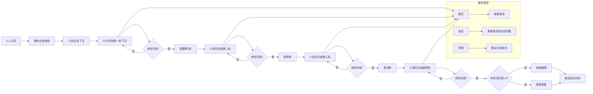

# 🃏 德州扑克游戏 [](https://github.com/czhmisaka/texas_staticWeb_demo/stargazers) [](http://texas.czht.top/)

基于JavaScript实现的德州扑克游戏，包含完整的游戏逻辑和AI对手系统。

## ✨ 主要功能

- ♠️ 完整的德州扑克游戏规则实现
- 🤖 智能AI对手系统
- 🃏 卡片评估和胜负判断
- 🖥️ 用户界面管理
- 🎭 丰富的动画效果(发牌、下注、胜利等)

## 📁 项目结构

| 路径                  | 描述         |
| --------------------- | ------------ |
| `ai/`                 | AI相关模块   |
| `ai/ai-core.js`       | AI核心逻辑   |
| `ai/ai-evaluation.js` | 牌局评估     |
| `ai/ai-strategy.js`   | AI策略       |
| `cards.js`            | 卡片处理     |
| `cards-evaluator.js`  | 牌型评估     |
| `game.js`             | 游戏主逻辑   |
| `ui-manager.js`       | 用户界面管理 |
| `logger.js`           | 日志记录     |
| `index.html`          | 前端入口     |
| `style.css`           | 样式表       |
| `animations/`         | 动画效果文件 |

## 🖥️ 在线体验
直接访问: [http://texas.czht.top/](http://texas.czht.top/)

## 🚀 运行方式

1. 克隆仓库
```bash
git clone https://github.com/czhmisaka/texas_staticWeb_demo.git
```

2. 进入项目目录
```bash
cd texas_staticWeb_demo
```

3. 启动游戏
```bash
open index.html  # 或在浏览器中直接打开
```

## 🧩 主要模块说明

- **`game.js`**: 🎮 游戏核心逻辑，控制游戏流程和状态
- **`ai.js`**: 🧠 AI系统入口，协调各AI子模块
- **`cards.js`**: 🃏 卡片和牌组管理
- **`ui-manager.js`**: 💻 处理用户界面交互和显示

## 🤖 AI系统文档

详细AI系统设计文档请参阅：[AI系统文档](ai.md)

## 📜 游戏规则

### 🎴 完整游戏流程 (6人局详细流程)



### 💰 下注规则

1. **下注轮次**:
   - 每轮玩家可以选择：跟注、加注、弃牌或过牌
   - 下注顺序按顺时针方向进行

2. **盲注**:
   - 小盲注: 最低下注额的1/2
   - 大盲注: 最低下注额
   - 每局结束后盲注位置顺时针移动

### 🏆 牌型比较

从强到弱排序：
1. 👑 皇家同花顺
2. 🌊 同花顺
3. 4️⃣ 四条
4. 🏠 葫芦
5. 🌸 同花
6. ➡️ 顺子
7. 3️⃣ 三条
8. 2️⃣ 两对
9. 1️⃣ 一对
10. 🃏 高牌

### 🪙 筹码管理

- 初始筹码: 每位玩家1000筹码
- 盲注: 初始大盲20 小盲10，每30分钟盲注翻倍
- All-in: 当玩家意图show hand 或者 玩家筹码不足时，可全押剩余筹码

### ⚡ 特殊规则

- **平局**: 平分底池
- **All-in**: 创建边池处理超额下注
- **玩家退出**: 筹码由其他玩家平分

## 🤝 贡献指南

欢迎贡献代码！请遵循以下步骤：

1. Fork项目
2. 创建特性分支 (`git checkout -b feature/AmazingFeature`)
3. 提交更改 (`git commit -m 'Add some AmazingFeature'`)
4. 推送到分支 (`git push origin feature/AmazingFeature`)
5. 打开Pull Request

## ⚖️ 许可证

[MIT](https://choosealicense.com/licenses/mit/) © czhmisaka
