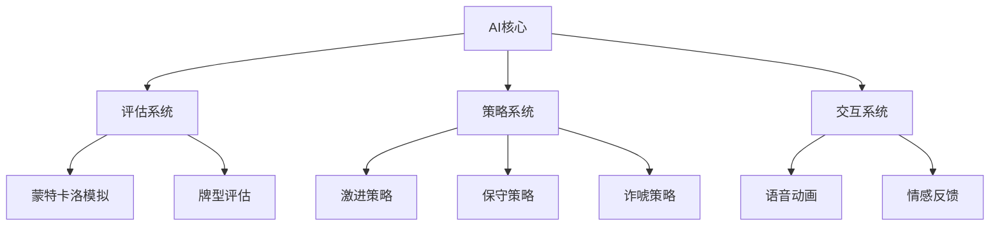
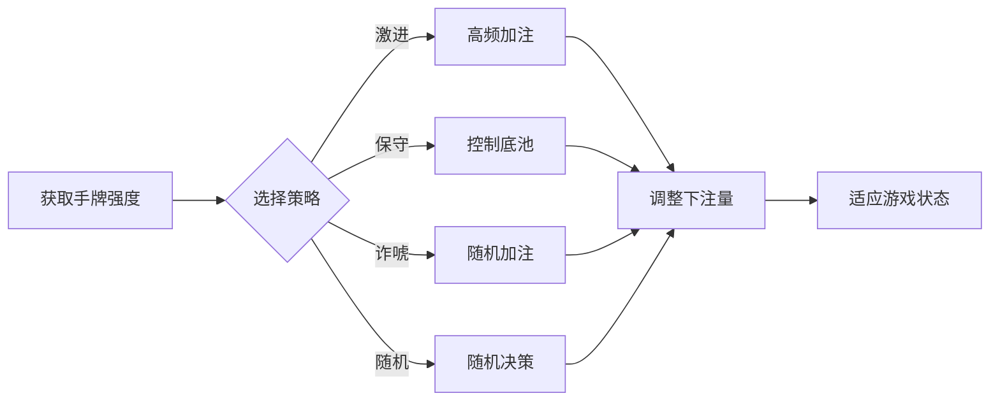

# 🤖 德州扑克AI系统文档

## 🧠 AI系统概述

德州扑克AI系统采用分层架构设计，包含以下核心组件：
- **评估层**：计算手牌强度
- **策略层**：根据牌力和游戏状态做出决策
- **交互层**：处理语音和情感反馈



## 🔍 核心架构

### `ai-core.js`
- 继承自策略系统
- 整合评估系统功能
- 主要功能：
  - 决策系统(`makeDecision`)
  - 虚张声势调整(`updateBluffChance`)
  - 个性调整(`adjustPersonalityBasedOnGameState`)

### `ai.js`
- AI系统入口
- 继承自`ai-core.js`
- 实现情感反馈功能(`getEmotionalFeedback`)

## 📊 评估系统(`ai-evaluation.js`)

### 主要评估方法
1. **初始手牌评估** (`monteCarloHoleCardEvaluation`)
   - 使用蒙特卡洛模拟评估起手牌强度
   - 模拟200次随机牌局

2. **公共牌评估** (`monteCarloEvaluation`)
   - 考虑已知公共牌
   - 模拟100次剩余牌局

3. **综合手牌评估** (`evaluateCombinedHand`)
   - 完整7张牌评估
   - 考虑牌型和踢脚牌

### 评估公式
```
手牌强度 = 牌型基础分(0-1) + 踢脚牌加成(0-0.05)
```

## 🎯 策略系统(`ai-strategy.js`)

### 策略类型
| 策略 | 特点     | 适用场景   |
| ---- | -------- | ---------- |
| 激进 | 高频加注 | 筹码较少时 |
| 保守 | 谨慎跟注 | 筹码较多时 |
| 诈唬 | 虚张声势 | 中等牌力   |
| 随机 | 不可预测 | 默认策略   |

### 决策流程


## 💬 交互系统

### 语音动画(`ai-speech-animations.js`)
- 支持20+种表情类型
- 动态气泡定位
- 音效系统
- 动画效果：
  - 常规消息：淡入
  - 重要消息：震动+脉冲
  - 皇家同花顺：礼花动画

### 情感反馈(`ai.js`)
根据最后动作和手牌强度返回表情和文本：
- **加注**：😎 加注收割 / 😈 虚张声势
- **跟注**：😏 跟注钓鱼 / 😐 跟一手
- **弃牌**：😤 不跟了 / 😒 没意思

## 🛠️ 扩展接口

```javascript
// 自定义AI个性
class CustomAI extends TexasHoldemAI {
    constructor(game, playerIndex) {
        super(game, playerIndex);
        this.personality = 'custom';
    }

    customStrategy(handStrength) {
        // 实现自定义策略
    }
}
